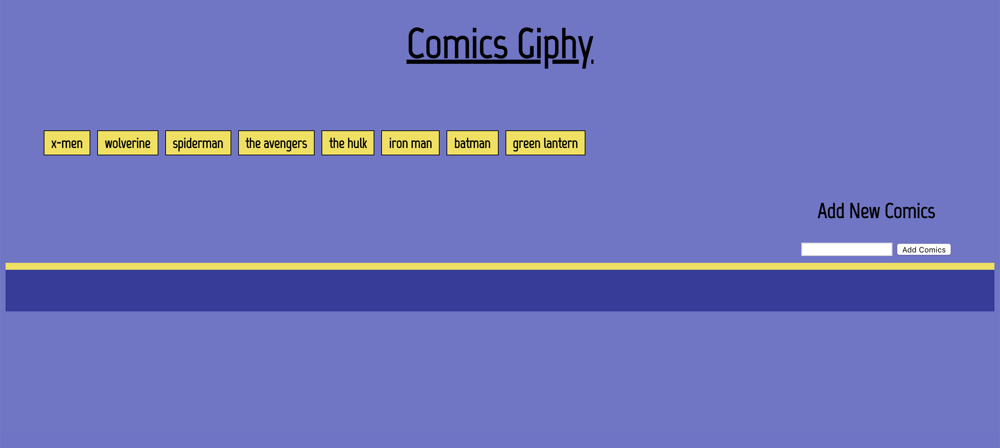
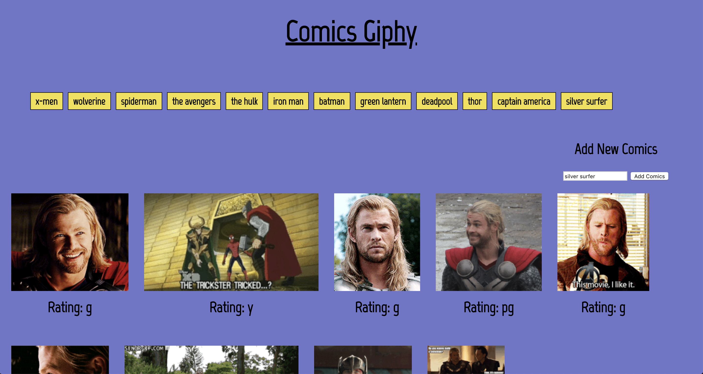

# Comics-Giphy

### Overview

In this assignment I used the GIPHY API to make a dynamic web page that populates with gifs. I  called the GIPHY API and used JavaScript and jQuery to change the HTML of the site. Add your own comic book by simply typing the name of the comic and click "submit comics" button. This should populate another button at the top with the comic you added. Select the comic book button and watch as the gifs populate, click one of the gifs to animate it. 

### Getting Started
https://rparamo11.github.io/comics-giphy/

#### Click on the comic book of your choice to reveal the giphs from the selected comic book.

#### Add your favorite comic book to the list, once added, selected the comic book and watch as your favorite comic book giphs appear. 

### Technologies Used
* JavaScript
* jQuery
* Giphy API
